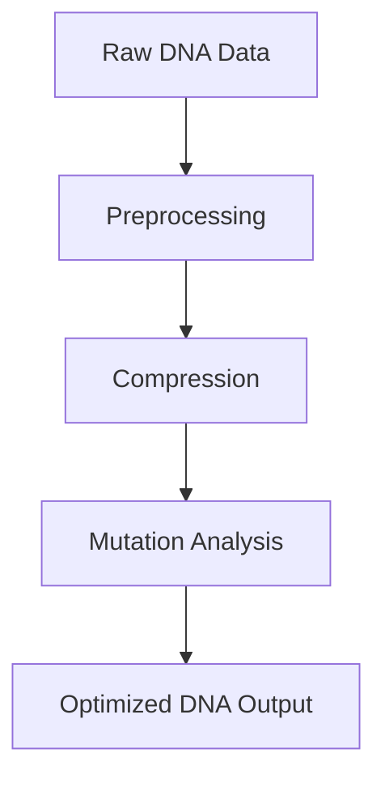
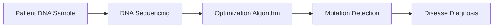
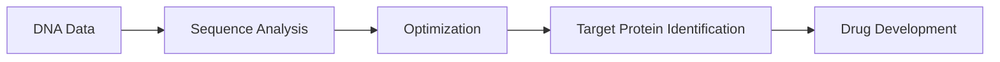
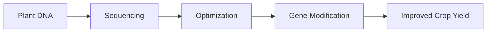
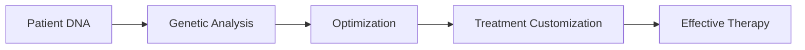
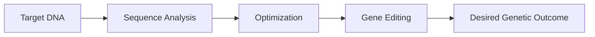

# Real-World Use Cases of DNA Sequencing Optimization

## 🔬 Overall Workflow

---

## 🧬 1. Healthcare (Disease Detection)

### Problem Statement:

Early detection of genetic diseases is slow and expensive.

### Solution:

DNA sequencing optimization helps analyze genetic mutations faster and more accurately.

### Diagram:

---

## 💊 2. Drug Discovery

### Problem Statement:

Drug development is time-consuming and costly.

### Solution:

Optimized DNA analysis speeds up identification of target proteins for drug development.

### Diagram:

---

## 🌾 3. Agriculture (Crop Improvement)

### Problem Statement:

Crop diseases and low yield affect food production.

### Solution:

DNA optimization helps create genetically stronger and disease-resistant crops.

### Diagram:

---

## 🧬 4. Personalized Medicine

### Problem Statement:

Different patients respond differently to the same treatment.

### Solution:

DNA sequencing optimization enables personalized treatment based on an individual’s genetic profile.

### Diagram:

---

## 🧪 5. Genetic Engineering

### Problem Statement:

Precise modification of genes is complex and error-prone.

### Solution:

DNA optimization ensures accurate gene editing for better results in genetic engineering.

### Diagram:

---

## 🚀 Future Scope

* AI-based DNA optimization
* Real-time genome analysis
* Advanced personalized medicine
* Faster drug discovery systems
